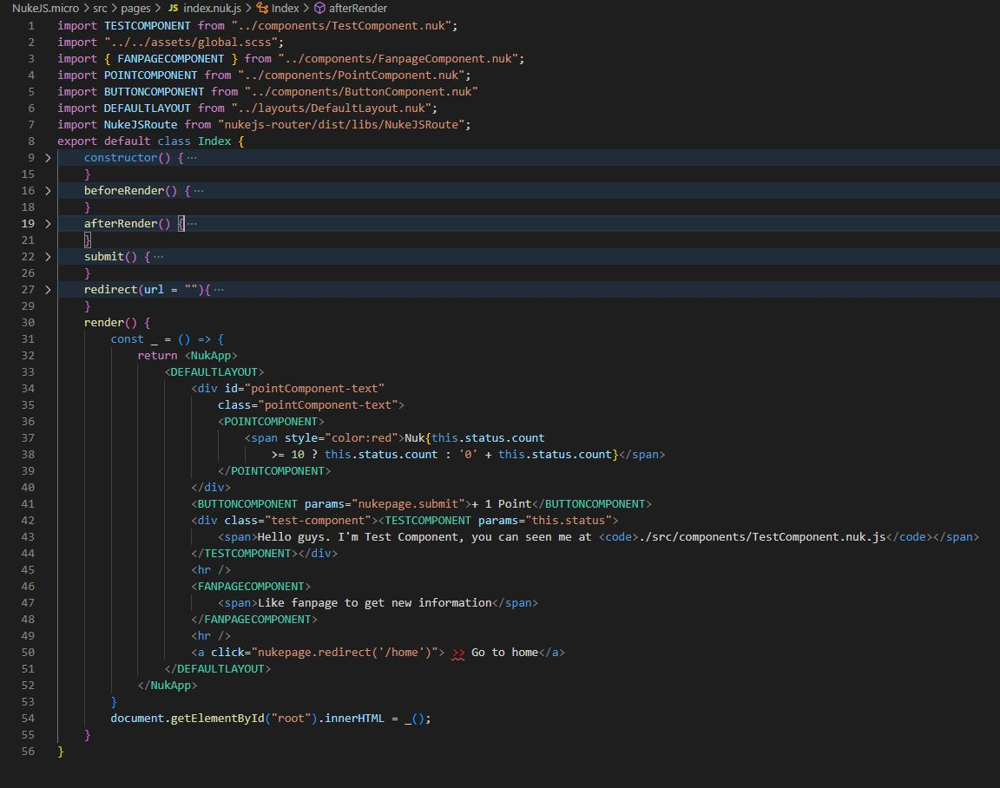
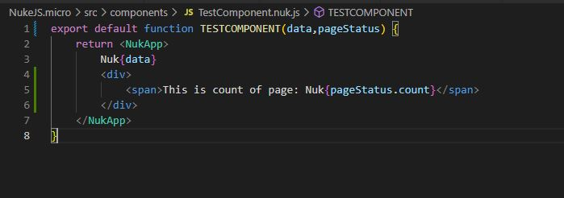
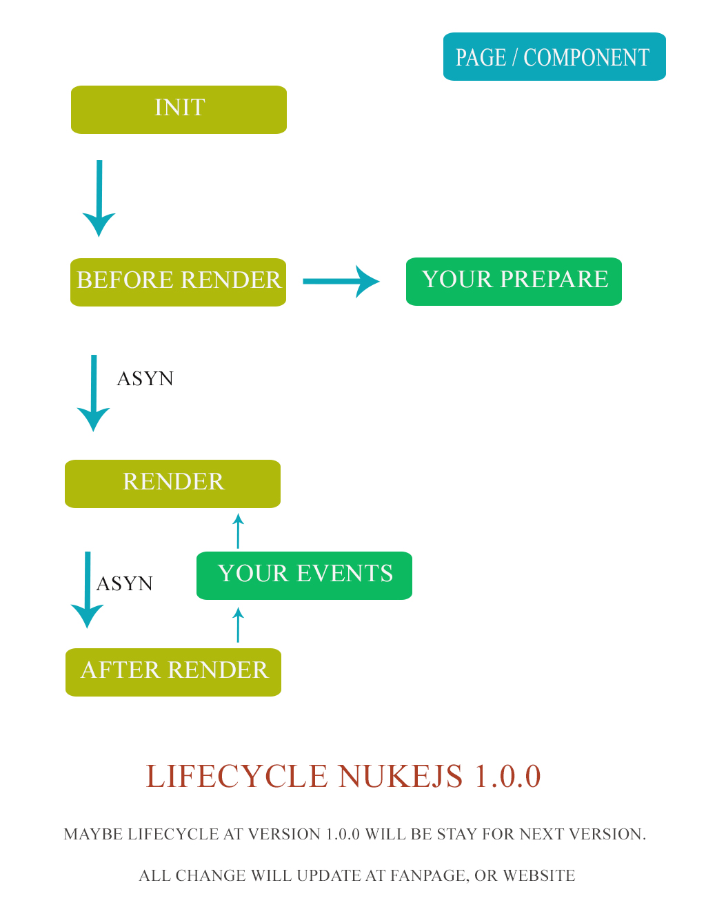

# 🚀 Welcome to NUKEJS - VERSION MICRO!

NukeJS version micro is framework run in Javascript and currently only support for web. 

-   Supports build 
    + Single Page
    + Multi page application
    + Easy implment for framework MVC as : Laravel, Spring Boot, CakePHP, ExpressJS ...etc

## How to install? 

- First step: 
    - Go to root project and run command line: `git clone https://github.com/steveleetn91/NukeJS.micro.git`
- Next step:    
    - After got done clone. You need install `npm install`

## How to build? 
- Go to root project and run command line: `npm run build`
## How to run development server? 
- Go to root project and run command line: `npm run serve`
## Structure 

- Rules:
    - To start a Nuke page with full options you need use like this:
        
    - To start a Nuke page with SGP you need use like this:
        . 
        
        If you need more information for SGP then pls consider structure beta 1.1.
    - To print any things:
        - You need type ` Nuk{yourVariable}`
        - To include an compoent you need create new a component with name is uppercase letter. Example include component:
            - ` <EXAMPLECOMPONENT> Hello  Nuk{yourVariable} </EXAMPLECOMPONENT> `
    - Again I remember to you component name always will be uppercase letter. And don't use any `functions` on `<NukApp>`, it's only component. So If I need call API before load UI for component? How we do it? Very easy, you have seen you compoent function our have a space before return `<NukApp>`. Do a something in that. Of course if has any events in compoent you can use `ComponentRender` to rerender again for that component.
    - In case you need use data for component, so let's try use ` params="nukepage.status" `. Example: `<EXAMPLECOMPONENT params="nukepage.status"> Your point Nuk{componentParam.point} </EXAMPLECOMPONENT>`:
        
    - `registerCallback` => only use for SGP 
- Lifecycle 
    - 

- Routers:
    - To config a new router, pls go to `./src/router.nuk.js`. Don't forget: we using `$id` for config params. Example you need a params `slug` for detail your post in URL.

- Assets
    - scss 
        - to import scss file you need type `import ./you-file.scss`;
    - image 
        - to import image file you need type `require('./your-image.png')`. Example ``;

- Manage status
    - Only use for SGP: `setStatus`
- Render 
    - `Nuke.ComponentRender(root_id,NukeElement)`: Only use for SGP
    - You can recall render while you need render again.
    