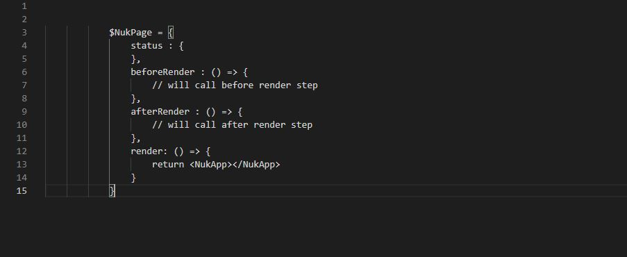

# 🚀 Welcome to NUKEJS - VERSION MICRO!

This is document to use NukeJS Micro

## How to install? 

- First step: 
    - Go to root project and run command line: `git clone https://github.com/steveleetn91/NukeJS.micro.git`
- Next step:    
    - After got done clone. You need install `npm install`

## How to build? 
- Go to root project and run command line: `npm run build`
## How to run development server? 
- Go to root project and run command line: `npm run build`
## Structure 

- Rules:
    - To start a Nuke page you need use like this:
        
    - To print any things:
        - You need type ` Nuk{yourVariable}`
        - To include an compoent you need create new a component with name is uppercase letter. Example include component:
            - ` <EXAMPLECOMPONENT> Hello  Nuk{yourVariable} </EXAMPLECOMPONENT> `
    - Again I remember to you component name always will be uppercase letter. And don't use any `functions` on `<NukApp>`, it's only component. So If I need call API before load UI for component? How we do it? Very easy, you have seen you compoent function our have a space before return `<NukApp>`. Do a something in that. Of course if has any events in compoent you can use `ComponentRender` to rerender again for that component.

- Lifecycle 
    - Waiting for update

- Pages:
    - To config pages you need modifine at `package.json` in key `pages` 
    - Example:
        `"pages": {
            "index": "./src/index.nuk.js",
            "index/index2": "./src/index/index2.nuk.js"
        }` 

- Assets
    - scss 
        - to import scss file you need type `import ./you-file.scss`;
    - image 
        - to import image file you need type `require('./your-image.png')`;

- Manage status
    - To update and render page again use `Nuke.setStatus(key,value)`.
    - render only at a div or a component use: `Nuke.ComponentRender(root_id,NukeElement)`. Mean is only render at element has that id.
    - Remember: Don't forget define your status before `setStatus` and `ComponentRender` 